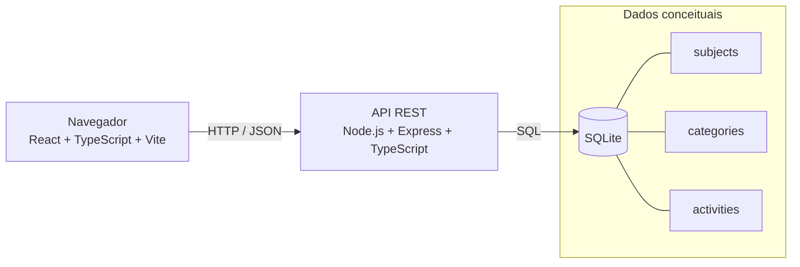

# Taskly — Arquitetura Inicial

## Visão geral

O Taskly prevê inicialmente uma arquitetura Web cliente-servidor simples. Quando implementada, a interface React será executada no navegador e consultará uma API REST Express. A API será responsável pelas regras da aplicação e pela persistência no SQLite.



## Frontend

O frontend utilizará React, TypeScript e Vite em uma etapa futura. Suas responsabilidades previstas são:

- apresentar as quatro interfaces definidas na proposta;
- coletar e validar dados de entrada no nível de interface;
- enviar requisições HTTP à API;
- apresentar respostas, estados de carregamento e erros;
- calcular apenas comportamentos estritamente visuais.

Organização futura sugerida, ainda não criada nesta etapa:

```text
frontend/src/
├── components/   # componentes de interface reutilizáveis
├── pages/        # composição das telas
├── services/     # comunicação HTTP futura
├── types/        # tipos do frontend
├── App.tsx
└── main.tsx
```

## Backend

O backend utilizará Node.js, TypeScript e Express em uma etapa futura. Suas responsabilidades previstas são:

- expor operações por uma API REST;
- validar dados recebidos;
- aplicar regras de negócio;
- coordenar serviços e repositórios;
- acessar a persistência;
- produzir respostas HTTP e erros consistentes.

Organização futura sugerida, ainda não criada nesta etapa:

```text
backend/src/
├── controllers/  # entrada e saída HTTP
├── routes/       # definição de endpoints
├── services/     # regras e casos de uso futuros
├── repositories/ # acesso a dados futuro
├── database/     # configuração e migrations futuras
├── app.ts
└── server.ts
```

Na Etapa 01, a API ainda não foi implementada e nenhum endpoint está disponível.

## Persistência

O SQLite está previsto por não exigir um servidor separado e por facilitar execução local, testes, portabilidade e apresentação acadêmica. As tabelas conceituais serão:

- `subjects` para disciplinas;
- `categories` para categorias;
- `activities` para atividades, incluindo referências à disciplina e à categoria.

O banco físico e suas migrations serão criados em uma etapa posterior. Arquivos de banco local não serão versionados.

## Comunicação HTTP

O frontend e o backend se comunicarão por HTTP, utilizando JSON. A API seguirá convenções REST compatíveis com as operações descritas na proposta. Endereços, formatos detalhados e códigos de resposta do CRUD serão definidos quando os casos de uso forem implementados.

Contrato inicial previsto para uma etapa futura:

```http
GET /health
```

```json
{
  "status": "ok",
  "application": "Taskly"
}
```

## Responsabilidades das camadas

| Camada | Responsabilidade principal | Não deve assumir |
| --- | --- | --- |
| Interface | Interação e apresentação | Persistência ou regra central de negócio |
| Rotas e controladores | Traduzir HTTP para chamadas da aplicação | Executar SQL diretamente |
| Serviços | Orquestrar casos de uso e regras | Conhecer detalhes visuais do frontend |
| Repositórios | Isolar acesso aos dados | Definir respostas HTTP |
| Banco SQLite | Armazenar dados consistentes | Controlar fluxo de interface |

Essa separação é uma direção conceitual. As pastas `frontend`, `backend` e `tests` permanecem vazias nesta etapa e não representam camadas já implementadas.

## Evolução da arquitetura

A arquitetura poderá evoluir conforme novos requisitos surgirem. Mudanças como bibliotecas adicionais, autenticação, serviços externos ou novos processos não fazem parte da Etapa 01 e somente deverão ser introduzidas se houver necessidade acadêmica e técnica objetiva.
