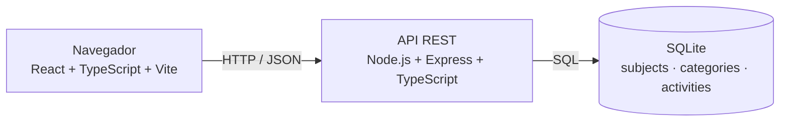

# Taskly — Proposta e Especificação Inicial

## 1. Nome da aplicação

**Taskly** — Sistema Web para organização e gerenciamento de atividades acadêmicas.

## 2. Descrição do problema

Estudantes precisam acompanhar simultaneamente trabalhos, provas, exercícios, projetos, prazos, prioridades e diferentes disciplinas. Quando essas informações ficam distribuídas entre anotações, mensagens, agendas e plataformas distintas, torna-se difícil reconhecer o que ainda precisa ser feito, quais entregas estão próximas, quais estão atrasadas e a que disciplina cada compromisso pertence.

O Taskly propõe centralizar essas informações em uma aplicação Web, oferecendo uma visão única e organizada das obrigações acadêmicas.

## 3. Público-alvo

O público-alvo inicial é formado por estudantes que precisam organizar atividades, trabalhos, avaliações e prazos acadêmicos. Nesta fase não são considerados perfis avançados, equipes ou organizações.

## 4. Objetivo principal

Permitir que estudantes cadastrem, organizem, acompanhem e consultem suas atividades acadêmicas de maneira centralizada, identificando prioridades, disciplinas, categorias, atividades pendentes, concluídas, atrasadas e próximas do prazo.

## 5. Funcionalidades previstas

1. Cadastrar atividades acadêmicas.
2. Editar atividades existentes.
3. Excluir atividades.
4. Organizar atividades por disciplina.
5. Classificar atividades por categoria.
6. Definir prioridade para uma atividade.
7. Marcar atividades como concluídas.
8. Filtrar atividades por status, disciplina, categoria e prioridade.
9. Pesquisar atividades pelo título.
10. Identificar automaticamente atividades atrasadas.
11. Exibir atividades próximas do prazo.
12. Exibir um resumo das atividades no Dashboard.

As funcionalidades acima compõem o escopo funcional previsto para a evolução do projeto. A Etapa 01 não inclui qualquer implementação dessas funcionalidades.

## 6. Entidades e conceitos do domínio

### 6.1 Atividade

Representa uma obrigação acadêmica do estudante.

| Campo | Descrição conceitual |
| --- | --- |
| `id` | Identificador único da atividade. |
| `título` | Nome curto da obrigação acadêmica. |
| `descrição` | Informações complementares sobre a atividade. |
| `prazo` | Data e horário limite para conclusão. |
| `prioridade` | Importância relativa: `LOW`, `MEDIUM` ou `HIGH`. |
| `status` | Situação persistida: `PENDING` ou `COMPLETED`. |
| `disciplina` | Disciplina à qual a atividade pertence. |
| `categoria` | Tipo atribuído à atividade. |
| `data de criação` | Momento em que o registro foi criado. |
| `data de atualização` | Momento da alteração mais recente. |

O estado `OVERDUE` será calculado pela aplicação a partir do prazo e do status, não sendo necessário persistir esse valor.

### 6.2 Disciplina

Representa uma disciplina acadêmica à qual as atividades podem ser associadas.

| Campo | Descrição conceitual |
| --- | --- |
| `id` | Identificador único da disciplina. |
| `nome` | Nome da disciplina. |
| `professor` | Nome do professor responsável, quando informado. |
| `cor` | Identificação visual opcional. |

Uma disciplina pode possuir várias atividades.

### 6.3 Categoria

Representa o tipo da atividade. Exemplos iniciais: Trabalho, Prova, Exercício, Projeto, Seminário e Outro.

| Campo | Descrição conceitual |
| --- | --- |
| `id` | Identificador único da categoria. |
| `nome` | Nome da categoria. |

Uma categoria pode classificar várias atividades.

## 7. Relações entre entidades

```text
Disciplina ─────< Atividade >───── Categoria
```

- uma disciplina possui várias atividades (`1:N`);
- uma atividade pertence a uma disciplina (`N:1`);
- uma categoria pode classificar várias atividades (`1:N`);
- uma atividade possui uma categoria (`N:1`).

O modelo inicial mantém as associações obrigatórias e simples. Regras de opcionalidade poderão ser refinadas quando o modelo físico do banco for criado.

## 8. Telas e interfaces

A proposta contém exatamente quatro telas principais, suficientes para o escopo inicial.

### 8.1 Dashboard

**Objetivo:** apresentar uma visão resumida da situação acadêmica do estudante.

Elementos previstos: quantidade de atividades pendentes, concluídas e atrasadas; próximas atividades; atividades próximas do prazo; e ação para criar uma atividade.

```text
┌──────────────────────────────────────────────────────┐
│ Taskly                             + Nova atividade  │
├──────────────────────────────────────────────────────┤
│                                                      │
│ Pendentes       Concluídas        Atrasadas          │
│    05               12                02             │
│                                                      │
├──────────────────────────────────────────────────────┤
│ Próximas atividades                                  │
│                                                      │
│ Trabalho API      TCS I          30/08     Alta      │
│ Lista SQL         Banco Dados    01/09     Média     │
│ Projeto           Engenharia     05/09     Alta      │
│                                                      │
└──────────────────────────────────────────────────────┘
```

### 8.2 Atividades

**Objetivo:** consultar e gerenciar todas as atividades cadastradas.

Elementos previstos: listagem; pesquisa; filtros por status, disciplina, categoria e prioridade; ações de criação, edição e exclusão.

```text
┌──────────────────────────────────────────────────────┐
│ Atividades                          + Nova atividade │
├──────────────────────────────────────────────────────┤
│ Buscar...                                            │
│                                                      │
│ Status ▼ Disciplina ▼ Categoria ▼ Prioridade ▼      │
├──────────────────────────────────────────────────────┤
│ Trabalho API      TCS I           30/08   Pendente  │
│ Lista SQL         Banco Dados     01/09   Concluída │
│ Projeto           Engenharia      05/09   Pendente  │
└──────────────────────────────────────────────────────┘
```

### 8.3 Criar/Editar Atividade

**Objetivo:** utilizar um único formulário para criar uma atividade ou alterar um registro existente.

Campos previstos: título, descrição, disciplina, categoria, prazo, prioridade e status.

```text
Nova atividade

Título
[_________________________________]

Disciplina
[______________________________ ▼]

Categoria
[______________________________ ▼]

Descrição
[_________________________________]
[_________________________________]

Prazo
[____/____/________]

Prioridade
[______________________________ ▼]

Status
[______________________________ ▼]

[Cancelar]                         [Salvar]
```

### 8.4 Disciplinas

**Objetivo:** organizar as atividades de acordo com as disciplinas.

Elementos previstos: listagem de disciplinas; criação; edição; quantidade de atividades associadas; quantidade de atividades pendentes.

```text
Disciplinas

+ Nova disciplina

Tecnologia de Construção de Software I
5 atividades
2 pendentes

Banco de Dados
7 atividades
3 pendentes

Algoritmos
4 atividades
1 pendente
```

A categoria será administrada inicialmente como dado de apoio ao formulário de atividade, sem exigir uma quinta tela principal.

## 9. Operações da aplicação

| Operação | Resultado esperado |
| --- | --- |
| Criar atividade | Registrar uma nova obrigação acadêmica com seus dados e associações. |
| Consultar atividades | Retornar a lista de atividades cadastradas. |
| Consultar uma atividade específica | Retornar os dados de uma atividade pelo identificador. |
| Atualizar atividade | Alterar os dados permitidos de uma atividade existente. |
| Excluir atividade | Remover uma atividade selecionada. |
| Marcar atividade como concluída | Atualizar o status para `COMPLETED`. |
| Filtrar atividades | Restringir resultados por status, disciplina, categoria e prioridade. |
| Pesquisar atividades | Localizar atividades pelo título. |
| Cadastrar disciplina | Registrar uma nova disciplina. |
| Atualizar disciplina | Alterar os dados de uma disciplina existente. |
| Cadastrar categoria | Registrar um novo tipo de atividade. |
| Associar atividade a disciplina e categoria | Vincular a atividade aos respectivos conceitos durante criação ou atualização. |

As futuras rotas HTTP serão definidas na etapa de implementação da API, preservando essas operações como contrato funcional de referência.

## 10. Tecnologias do cliente

- **React:** construção declarativa da interface por componentes.
- **TypeScript:** tipagem estática e maior segurança durante a evolução do código.
- **Vite:** servidor de desenvolvimento e processo de build simples e rápido.
- **CSS convencional:** estilos explícitos e organizados, sem dependência adicional nesta etapa.

Essa combinação atende à necessidade de uma aplicação Web incremental e mantém a base compreensível para apresentação acadêmica.

## 11. Tecnologias do servidor

- **Node.js:** ambiente de execução JavaScript no servidor.
- **TypeScript:** compartilhamento de linguagem e conceitos de tipos entre cliente e servidor.
- **Express:** definição simples de rotas e tratamento de requisições HTTP.

As tecnologias são apenas propostas nesta etapa. Nenhum servidor, endpoint ou CRUD foi implementado.

## 12. Persistência

O banco de dados previsto é o **SQLite**, por permitir execução local, testes, apresentação e portabilidade sem um serviço externo obrigatório. O modelo físico ainda não será implementado nesta etapa.

Tabelas conceituais previstas:

- `subjects`: disciplinas;
- `categories`: categorias;
- `activities`: atividades e referências à disciplina e à categoria.

Arquivos locais SQLite não serão versionados. Quando as migrations forem implementadas, elas serão mantidas no repositório para permitir a reprodução do esquema.

## 13. Visão geral da arquitetura



O navegador executará o frontend, que consumirá uma API REST por HTTP e JSON. A API concentrará regras de aplicação e acesso ao SQLite. A arquitetura é inicial e poderá evoluir conforme os requisitos das próximas etapas, sem introduzir complexidade antecipada.

## 14. Regras de negócio iniciais

1. Uma atividade possui o status persistido `PENDING` ou `COMPLETED`.
2. Uma atividade é considerada atrasada quando seu prazo é anterior à data atual e seu status é diferente de `COMPLETED`.
3. O estado `OVERDUE` é derivado e não precisa ser armazenado.
4. A prioridade de uma atividade deve ser `LOW`, `MEDIUM` ou `HIGH`.
5. Cada atividade deve estar associada a uma disciplina e a uma categoria no modelo inicial.
6. Marcar uma atividade como concluída altera seu status para `COMPLETED`.
7. Atividades próximas do prazo serão determinadas por uma janela de tempo a ser definida na etapa de implementação.
8. Pesquisa por título e filtros poderão ser combinados na consulta de atividades.

Regra de atraso:

```text
Se:
prazo < data atual
e
status != COMPLETED

Então:
atividade é considerada atrasada.
```

## 15. Escopo da Etapa 01

Esta etapa define o problema, o público-alvo, o objetivo, o escopo funcional, os conceitos do domínio, as relações, as interfaces, as operações, as tecnologias e a arquitetura inicial. O repositório contém somente documentação e pastas reservadas para o frontend, o backend e os testes, sem arquivos de implementação.

Matriz de atendimento dos doze requisitos acadêmicos da proposta:

| Requisito | Atendimento |
| --- | --- |
| Nome da aplicação | Seção 1 |
| Problema | Seção 2 |
| Público-alvo | Seção 3 |
| Objetivo | Seção 4 |
| Pelo menos 5 funcionalidades | Seção 5, com 12 funcionalidades |
| Pelo menos 3 entidades ou conceitos | Seção 6, com Atividade, Disciplina e Categoria |
| Pelo menos 3 interfaces | Seção 8, com exatamente 4 telas |
| Pelo menos 5 operações | Seção 9, com 12 operações |
| Tecnologia do cliente | Seção 10 |
| Tecnologia do servidor | Seção 11 |
| Persistência | Seção 12 |
| Diagrama geral da solução | Seção 13 |

## 16. Limitações atuais

- o CRUD de atividades, disciplinas e categorias ainda não foi implementado;
- o frontend e o backend ainda não possuem implementação;
- não existem endpoints ou dependências instaladas;
- o modelo físico e as migrations SQLite ainda não existem;
- filtros, pesquisa e cálculo de atrasos estão especificados, mas não implementados;
- não há testes automatizados nesta etapa;
- não há autenticação, notificações, integrações externas ou deploy de produção.

Essas limitações são deliberadas e mantêm a entrega compatível com o objetivo da Etapa 01.

## 17. Evolução prevista

Nas próximas etapas, a mesma base poderá receber, de forma incremental:

1. esquema e migrations SQLite para as três entidades;
2. repositórios, serviços, controladores e rotas da API;
3. telas funcionais e integração do frontend com a API;
4. regras de atraso e proximidade do prazo;
5. filtros, pesquisa e resumo do Dashboard;
6. validações de entrada e tratamento padronizado de erros;
7. testes unitários e de integração;
8. evidências visuais e técnicas de cada entrega.

Qualquer evolução arquitetural deverá ser justificada pelos requisitos efetivos da disciplina.
